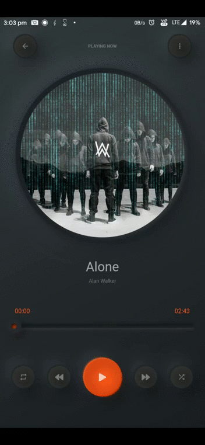
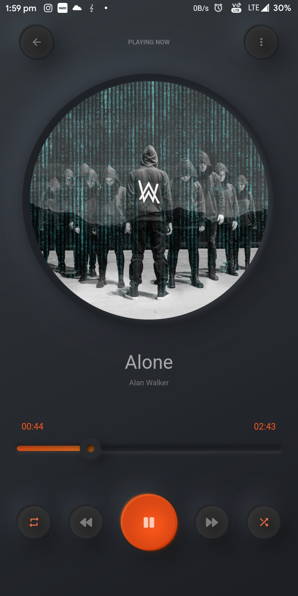
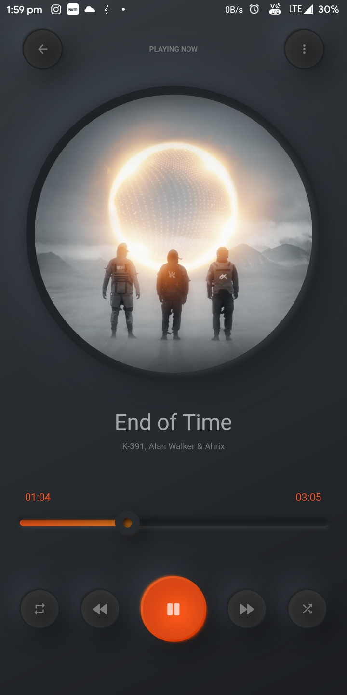
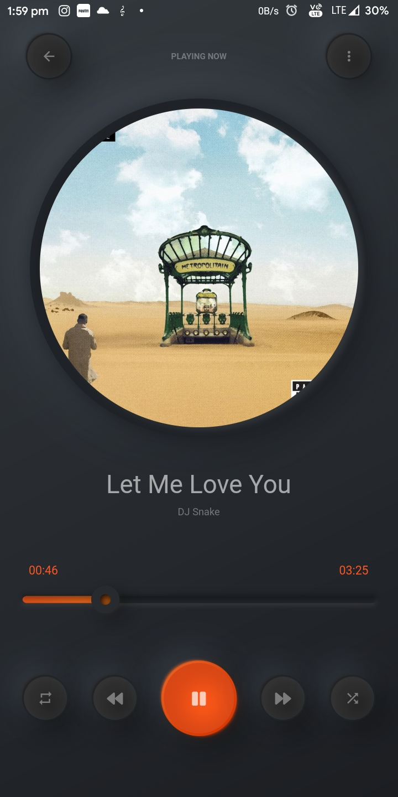
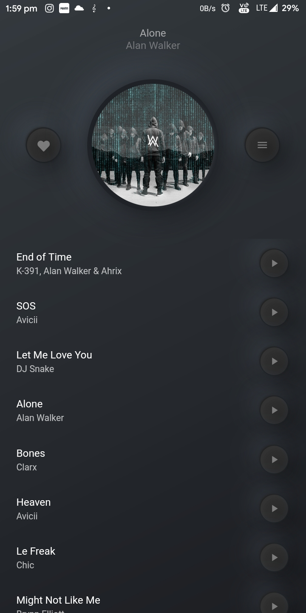
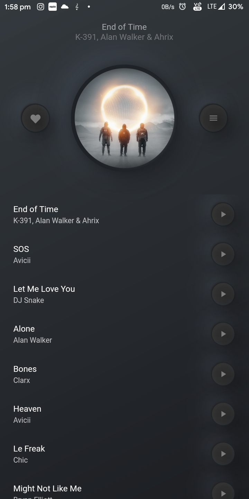

<!--  -->
# Music Player App

This is a beautiful music player, developed using Flutter.

## Features

- Play any song included in Flutter Assets
- Background Play
- Beautiful Material Design
- Custom Flare Animations

## Demo

## Usage

APK File : `assets/app/apk-release.apk`

## Dependencies

1. Font Awesome Package for Custom Icons `font_awesome_flutter: 8.8.1`
2. Audio Manager Package for interacting with music `audio_manager: ^0.5.3+2`
3. Path Provider Package for handling interactions with files `path_provider: ^1.6.5`
4. Flare Package for Custom Animations `flare_flutter: ^2.0.2`

## Todo

- [x] Play music from Flutter Assets
- [x] Show custom animations
- [ ] Fetch Music cover arts from Internet
- [x] Show all tracks in queue view
- [ ] Favourite Songs
- [ ] Search between available songs
- [ ] Fix pausing of songs while changing screens
- [ ] Add Gradient menu for songs
- [ ] Add Hero animations

Design inspired by [Filip Legierski](https://dribbble.com/kedavra)